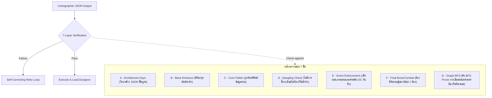

# 🗂️ สไลด์สำรองสำหรับการสอบวิทยานิพนธ์ (Thesis Defense: Backup Slides Appendix)
### สรุปสาระสำคัญเชิงเทคนิคและสถิติตัวเลขสำหรับการตอบคำถามคณะกรรมการ (Q&A Ready)

---

## 📊 Slide B-1: ตารางสรุปเปรียบเทียบเชิงประสิทธิภาพ (Proposed vs. Baseline)
> *สำหรับตอบคำถามเรื่อง: "ระบบเครื่องยนต์ Two-Path ดีกว่าการใช้ LLM ตัวเดียวธรรมดาอย่างไรในเชิงตัวเลข?"*

| ตัวชี้วัดเชิงวิศวกรรม (Metrics) | สถาปัตยกรรม Two-Path (ระบบที่เสนอ) | Naive Single-LLM Baseline (ตัวแบบเดี่ยว) | คำอธิบายเชิงสถาปัตยกรรม (Architectural Justification) |
| :--- | :---: | :---: | :--- |
| **ความถูกต้องของการแบ่งเส้นทาง (Routing)** | **100%** | **N/A** (ไม่สามารถคัดกรองได้) | Two-Path ใช้ Regex-First กรองคำสั่งง่ายได้ 80% แบบ Zero-Cost |
| **ความแม่นยำทางตรรกะคณิตศาสตร์ (S_sync)** | **94.4%** *(Hardened: 100%)* | **9.5%** *(หลอนกฎระบบ)* | Two-Path บังคับคำนวณลูกเต๋าและ HP บน Python Core Deterministic |
| **ความแม่นยำเชิงสัญลักษณ์พิกัด (P_ground)** | **100%** | **0.0%** *(หลอนตำแหน่ง)* | Two-Path ล็อคระยะโจมตีและขีดจำกัดด้วย Zone-Based Matrix |
| **ความหน่วงเฉลี่ยสะสม (Avg Latency)** | **214 ms** *(Path A)* / **1.4s** *(Path B)* | **> 4,200 ms** *(บวมสะสม)* | Two-Path ทำ Local Interception เลี่ยงการเรียกภายนอกที่ไม่จำเป็น |
| **ปริมาณหน่วยความจำบวม (Token Bloat)** | **ลดลง 90%** ผ่าน Context Collapse | **บวมขึ้นเรื่อย ๆ** ตามประวัติแชท | Two-Path ล้างประวัติชั่วคราวและเก็บสถานะในรูปแบบ JSON ขนาดเล็ก |

---

## 🛡️ Slide B-2: โครงสร้างการตรวจสอบดักจับ 7 ชั้น (The 7-Layer Guardrail: ABCDEFG)
> *สำหรับตอบคำถามเรื่อง: "ระบบการทวนสอบแผนที่ JSON ป้องกันแผนที่พังหรือเกิดห้องลอยตัวได้อย่างไร?"*

- **สถิติการทวนสอบ:** อัตราการเกิด **Unreachable Rooms** หรือแผนที่พังในระดับฐานข้อมูลเหลือ **0%** จากการทดสอบรัน 90 เหตุการณ์
- **การกู้คืนระบบ:** หากชั้นใดตรวจสอบไม่ผ่าน ระบบจะเรียกกลไก **Self-Correcting Retry Loop** ส่ง Error Log กลับไปให้ Cartographer เจนใหม่ทันทีสูงสุด 3 ครั้ง หากพังหมดจะสลับเข้าระบบสำรอง **Fallback Template** อัตโนมัติ (รับประกันระบบไม่มีการ Crash ระหว่างการสาธิต)

---

## 🦴 Slide B-3: สถาปัตยกรรมแบบกระดูกและเนื้อหนัง (Skeleton & Flesh Math)
> *สำหรับตอบคำถามเรื่อง: "คุณควบคุมความสมดุลของศัตรูและค่าสถิติไม่ให้ AI ตั้งแต้มโกงได้อย่างไร?"*

> [!IMPORTANT]
> **การแบ่งสิทธิการควบคุม (Separation of Controls):**
> - **Skeleton (Python Core):** คำนวณเลือด (HP) เกราะ (AC) และทอยเต๋าแบบสัญลักษณ์ (Deterministic Math)
> - **Flesh (LLM Generative):** สร้างชื่อมอนสเตอร์และการบรรยายท่าทางโจมตี (Flavor Text เท่านั้น)

### สูตรคณิตศาสตร์การสเกลความยากของมอนสเตอร์อัตโนมัติ (Dynamic scaling formula):
$$\text{Calculated HP} = \max(\text{MIN\_HP}, \text{Player Max HP} \times \text{Multiplier})$$

*   **Minion (ลูกกระจ๊อก):** `HP Mult = 0.4` | ดาเมจเฉลี่ยค่อนข้างต่ำ เหมาะสำหรับกลุ่มศัตรูจำนวนมาก
*   **Skirmisher (แนวหน้า):** `HP Mult = 0.7` | ค่าเกราะ AC พื้นฐาน 12 ใช้การทอยเต๋า `1d6`
*   **Brute (ยักษ์ใหญ่ทรงพลัง):** `HP Mult = 1.2` | เลือดและดาเมจค่อนข้างสูง ทอยเต๋าแรงเป็น `1d8`
*   **Boss (หัวหน้าใหญ่ประประจำด่าน):** `HP Mult = 2.5` | เลือดมหาศาล ค่าสถิติ PHYS/MENT สูงครอบคลุมทุกด้าน

---

## 💤 Slide B-4: กลไกการพักผ่อนและการฟื้นฟู (Automatic Rest Mechanism)
> *สำหรับตอบคำถามเรื่อง: "การพักผ่อน (Rest/Camp) ทำงานอย่างไร และเหตุใดถึงไม่มีการทอยลูกเต๋า?"*

- **การออกแบบกฎเกณฑ์สตรีมไลน์ (Streamlined Design):**
  - หลีกเลี่ยงขั้นตอนทอยลูกเต๋าที่ยืดเยื้อในระบบ D&D แบบดั้งเดิม (เช่น Hit Dice ใน 5e) 
  - การตั้งแคมป์ (Short Rest/Sleep) จะทำระบบ **ฟื้นพลังชีวิตเต็มอัตโนมัติทันที (Automatic Full Heal - HP เด้งคืนสู่ระดับสูงสุด)** และคืนประจุทักษะความสามารถระยะสั้น (เช่น Second Wind ของ Fighter)
- **เงื่อนไขเชิงความปลอดภัย (Safety Pre-conditions):**
  - **Combat Guard:** ห้ามพักผ่อนกลางห้องต่อสู้ที่มีศัตรูเด็ดขาด
  - **Trap/Puzzle Guard:** ห้ามพักผ่อนในห้องกับดักหรือปริศนาที่ยังไม่ถูกไขออกเพื่อเสถียรภาพการรันสเตตเนื้อเรื่อง

---

## 🛠️ Slide B-5: ประวัติการแก้ไขและผลสัมฤทธิ์การ Harden ระบบ (Hardening & Bug Remediation Log)
> *สำหรับตอบคำถามเรื่อง: "คุณแก้ปัญหาข้อขัดข้องระบบ (Bugs) ที่ตรวจพบในการทดสอบรอบแรกอย่างไรบ้าง?"*

> [!TIP]
> **สถานะปัจจุบัน: 100% RESOLVED & FULLY VERIFIED (ผ่านการทดสอบย่อย 98/98 เคสสีเขียวทั้งหมด)**
> ทุกข้อผิดพลาดเชิงลอจิกและข้อบกพร่องของระบบประเมินผลรอบแรกได้รับการแก้ไข ดักจับ และเขียนโค้ดทวนสอบระบบ (Unit Test Validation) ครบถ้วนเสร็จสมบูรณ์ในเครื่องยนต์ปัจจุบัน:

### 📌 รายการข้อบกพร่องที่ได้รับการแก้ไขเชิงสถาปัตยกรรม (Remediation Actions):
1. **ช่องพลังศักดิ์สิทธิ์ (Divine Smite Charge Consumption):**
   - *เดิม:* ตัดแต้มช่องใช้พลังล่วงหน้าทันทีที่สั่ง ทำให้หากทอยแต้มโจมตีวืด (Miss) แต้มจะเสียเปล่า
   - *แก้ไข:* ปรับลอจิกใน `intents.py` และ `rules_engine.py` ให้ตรวจสอบสิทธิก่อนรัน แต่หักประจุแต้มจริง **เฉพาะเมื่อโจมตีโดนสำเร็จเท่านั้น (`is_hit == True`)** ตรงตามกฎดั้งเดิม 5e [✅ FIXED]
2. **การป้องกันการเคลื่อนที่เบิ้ล (Movement Action Validation):**
   - *เดิม:* ผู้เล่นสามารถใช้คำสั่งคอมโบเคลื่อนที่ย้อนกลับเพื่อลัดหลีกการขีดจำกัด 1 โซนต่อเทิร์นได้
   - *แก้ไข:* บังคับให้การขยับในโซนเดิม (no-op moves) ถือเป็นสิทธิ์การขยับประจำเทิร์นทันที ปิดทางเดินลัดเลี่ยงระบบแอคชั่น [✅ FIXED]
3. **เคสหลอนดื่มยาเปล่า (C-42 Potion Rule Enforcement):**
   - *เดิม:* ผู้เล่นไม่มีขวดยาในประเป๋าจริงแต่สามารถสั่งดื่มยาเพิ่มเลือดได้โดย AI Baseline ปล่อยผ่าน
   - *แก้ไข:* ติดตั้งการอินเตอร์เซ็ปต์เชิงสัญลักษณ์ ล็อคหักลบจริงจากอาร์เรย์เป้ผู้เล่น หากขวดเป็น 0 ระบบจะขึ้นปฏิเสธการดื่มยาทันที [✅ FIXED]
4. **การปรับปรุงประสบการณ์ผู้ใช้งานบอร์ดเควส (Quest Board UX):**
   - *เดิม:* แสดงรายละเอียดเคสภารกิจและกระดานบอร์ดทุกครั้งที่ย้ายห้องสร้างความรกตาแก่ผู้เล่น
   - *แก้ไข:* สตรีมไลน์ UI ใน `exploration_ui.py` ให้แสดงรายละเอียดบอร์ดเควสเฉพาะเมื่อผู้เล่นป้อนคำสั่งเรียก `QUEST` เท่านั้น [✅ FIXED]
5. **การเปิดใช้งานปริศนาเหมืองฝึกหัด (Rusted Gate Puzzle Activation):**
   - *เดิม:* ห้องทดสอบเหมือง `node_02` ตั้งค่าสถานะเริ่มต้นเคลียร์ผ่านล่วงหน้า ทำให้ไม่มีปริศนาเปิดประตูเหล็ก
   - *แก้ไข:* ปรับแต่งค่าเริ่มต้นให้เป็น `cleared: false` บังคับให้ผู้เล่นรันผ่านกลไกตรวจสอบเงื่อนไขปริศนาจริง [✅ FIXED]
6. **สตรีมไลน์ระบบนอนหลับฟื้นพลัง (Automatic Rest Heal):**
   - *เดิม:* ระบบใช้การทอยเต๋าแบบสุ่ม `1d8` ในการฟื้น HP ซึ่งทำให้ความยากและ pacing แกว่ง
   - *แก้ไข:* ปรับลอจิกเป็นฟื้นพลังเต็มร้อยอัตโนมัติ (Automatic Full Heal) และปรับกฎ Rest ในเล่มรองรับ [✅ FIXED]
